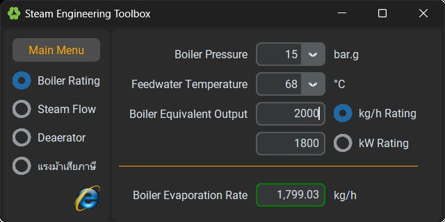

# pySTEAM
Tools and information for engineering and design of steam applications with python.

Tools :\
	python 3.x\
	[CustomTkinter](https://github.com/TomSchimansky/CustomTkinter)

Status :\
	Move to development on ironPython + WPF, repository ipyMEP\

\

L.Euttana
